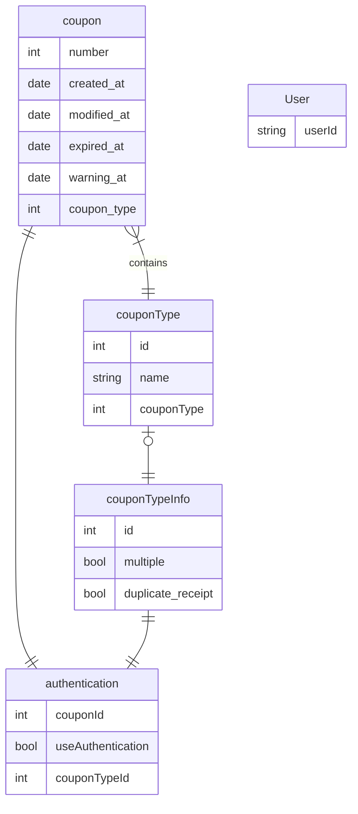

```mermaid
erDiagram
coupon {
    int number
    date created_at
    date modified_at
    date expired_at
    date warning_at
    int coupon_type
    
}

couponType {
    int id
    string name
    int couponType
}

authentication {
    int couponId
    bool useAuthentication
    int couponTypeId
}

couponTypeInfo {
    int id
    bool multiple
    bool duplicate_receipt
}

User {
    string userId
    
}
coupon }|--|| couponType : contains
couponType |o--|| couponTypeInfo : ""
coupon ||--|| authentication :""
couponTypeInfo ||--|| authentication :""


```