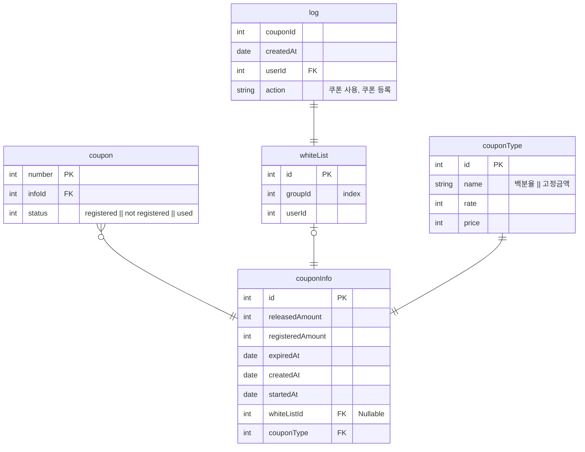

```mermaid
erDiagram
coupon {
    int number PK 
    int infoId FK 
    int status "registered || not registered || used"
}

couponType {
    int id PK
    string name "백분율 || 고정금액"
    int rate
    int price
}

whiteList {
    int id PK
    int groupId "index" 
    int userId
}

couponInfo {
    int id PK
    int releasedAmount
    int registeredAmount
    date expiredAt
    date createdAt
    date startedAt
    int whiteListId FK "Nullable"
    int couponType FK 
}

log {
    int couponId
    date createdAt
    int userId FK
    string action "쿠폰 사용, 쿠폰 등록"
}
coupon }o--|| couponInfo: ""
whiteList |o--|| couponInfo: ""
couponType ||--|| couponInfo: ""
log ||--|| whiteList: ""
```
