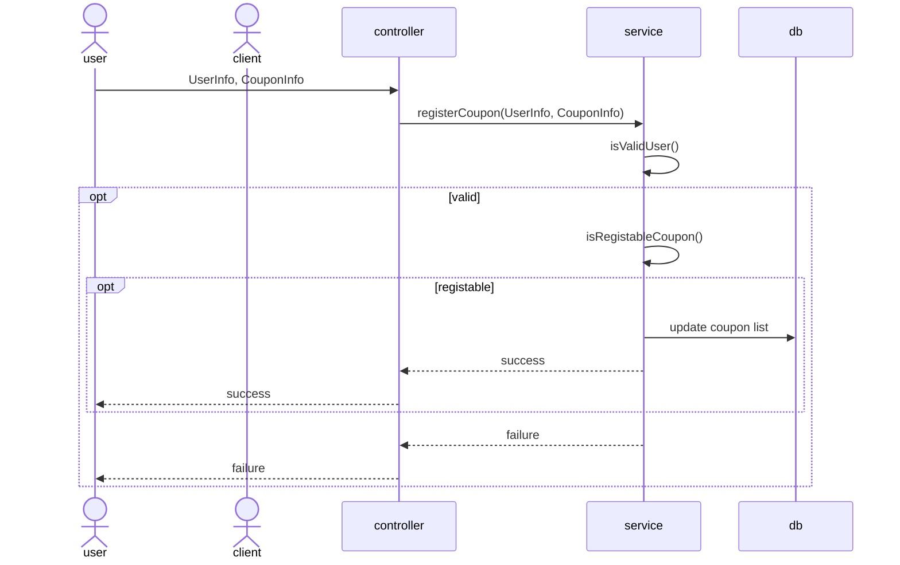
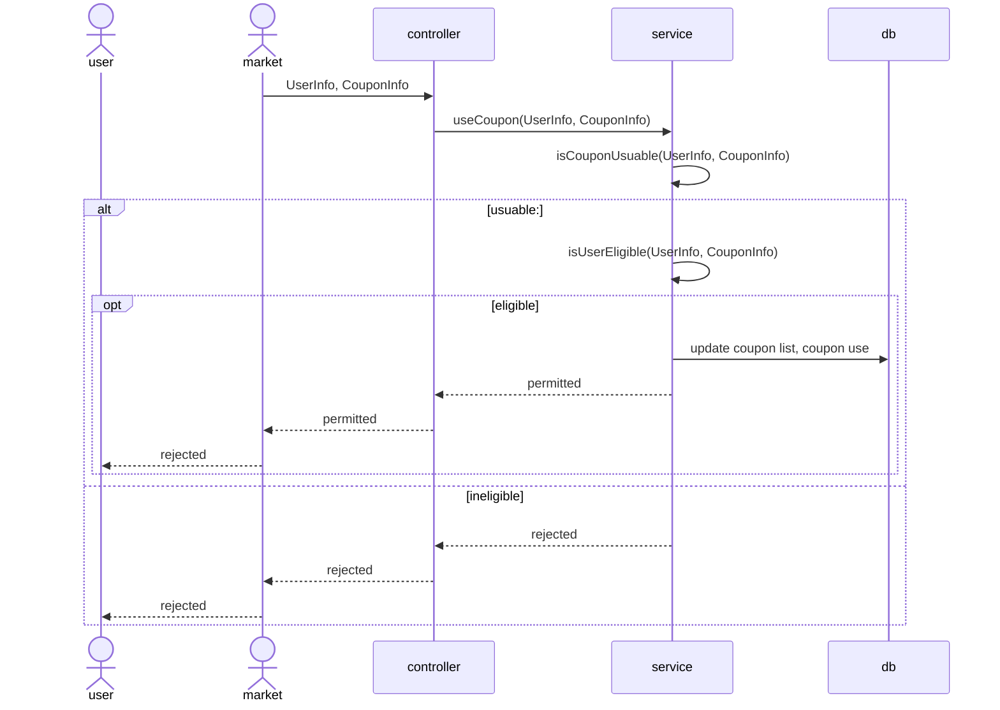
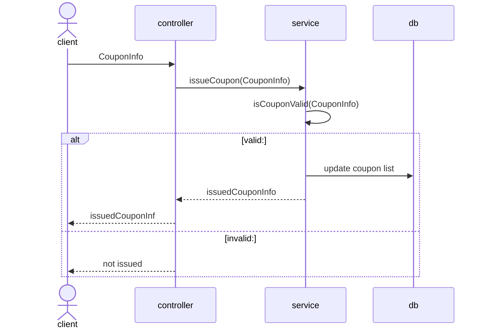
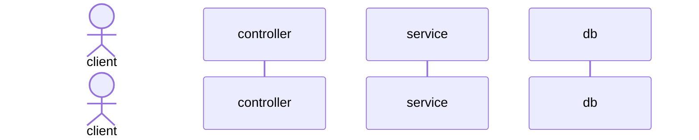

# 쿠폰 등록

```mermaid
sequenceDiagram
    actor user
    actor cl as client
    participant ctr as controller
    participant s as service
    participant db
    
    user->>ctr : UserInfo, CouponInfo
    ctr->>s: registerCoupon(UserInfo, CouponInfo)
    s ->> s : isValidUser()
    opt valid
        s->>s: isRegistableCoupon()
        opt registable
            s ->> db: update coupon list
            s-->> ctr: success
            ctr-->> user: success
        end
    s-->>ctr: failure
    ctr -->> user: failure
    end
```

## UserInfo 
* userID

## CouponInfo
* couponID
* 

## SavedCouponInfo

# 쿠폰 사용

```mermaid
sequenceDiagram
actor user
actor mk as market
participant ctr as controller
participant s as service
participant db

mk->>ctr: UserInfo, CouponInfo
ctr->>s: useCoupon(UserInfo, CouponInfo)
s->>s: isCouponUsuable(UserInfo, CouponInfo)
alt usuable:
    s->>s: isUserEligible(UserInfo, CouponInfo)
    opt eligible
        s->>db: update coupon list, coupon use
        s-->>ctr: permitted
        ctr-->>mk: permitted
        mk-->>user: rejected
    end
    else ineligible
    s-->>ctr: rejected
    ctr-->>mk: rejected
    mk-->>user: rejected
end
```

# 쿠폰 발급

```mermaid
sequenceDiagram
actor cl as client
participant ctr as controller
participant s as service
participant db
cl->>ctr: CouponInfo
ctr->>s: issueCoupon(CouponInfo)
s->>s: isCouponValid(CouponInfo)
alt valid:
s->>db: update coupon list
s-->>ctr: issuedCouponInfo
ctr-->>cl: issuedCouponInf
else invalid:
ctr-->>cl: not issued
end
```

## 고객사 리포팅 (보류)

```mermaid
sequenceDiagram
actor cl as client
participant ctr as controller
participant s as service
participant db
```
