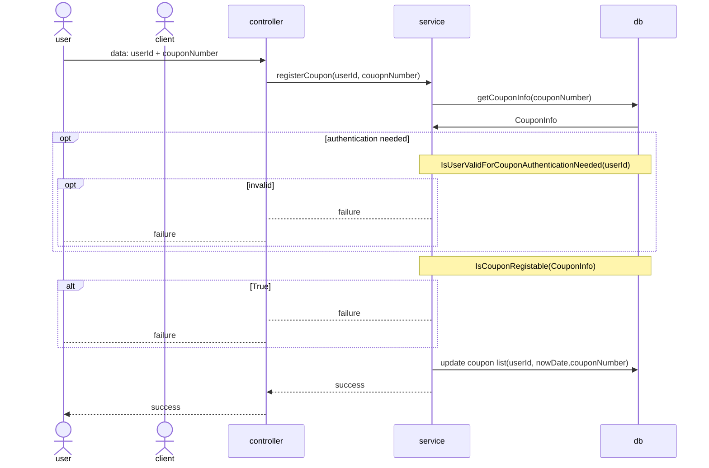
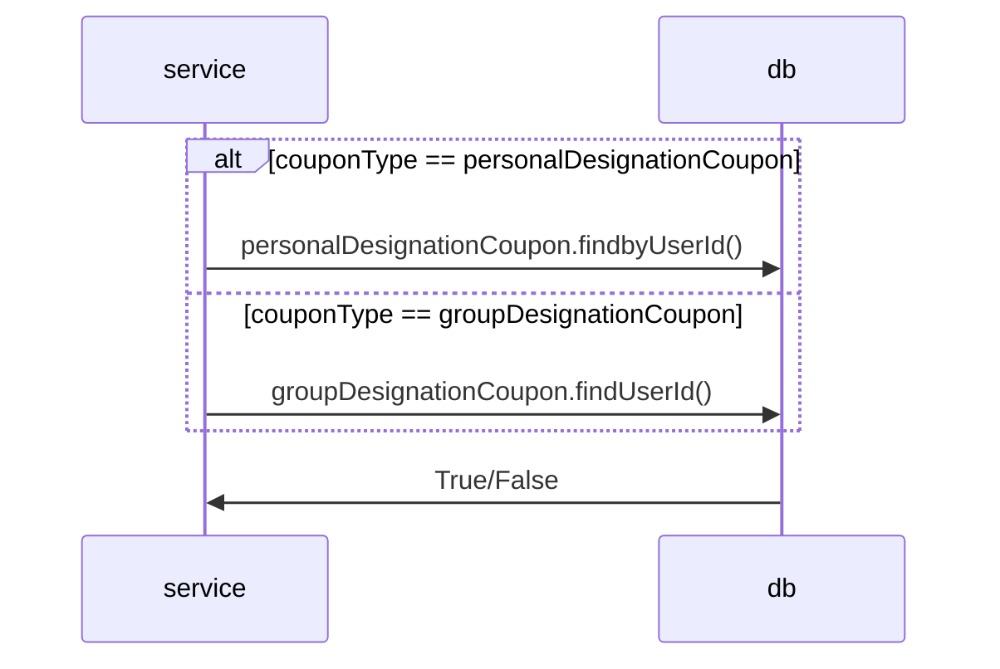
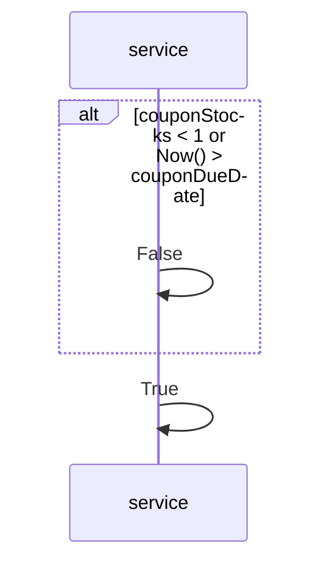
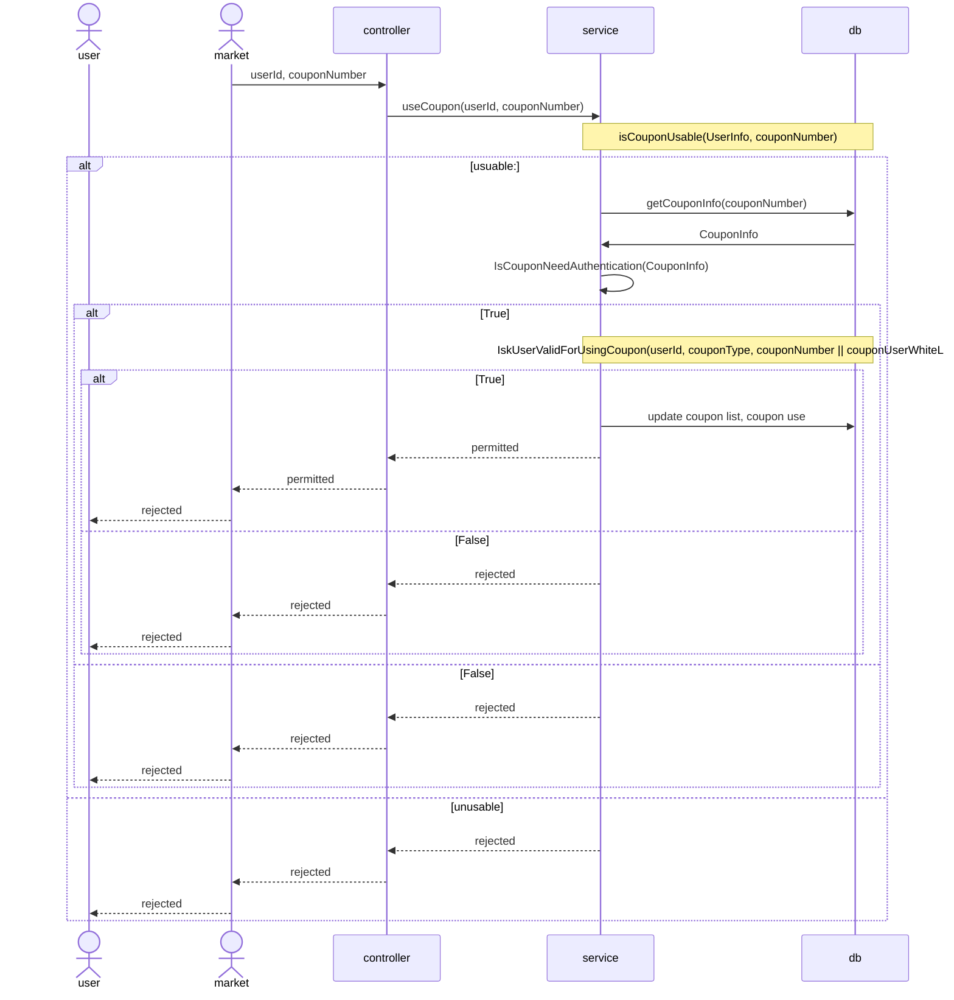
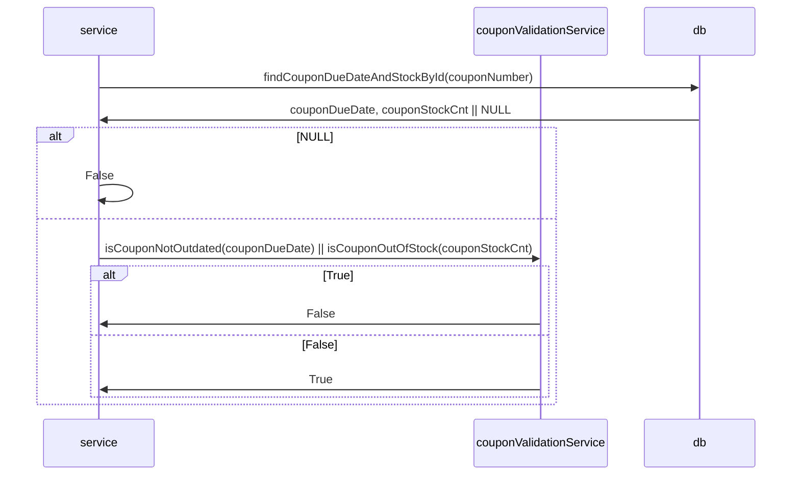
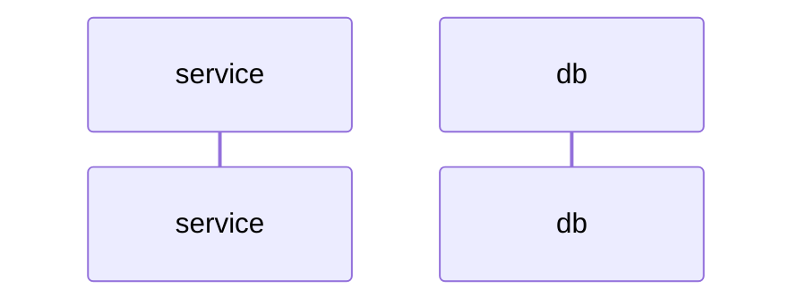
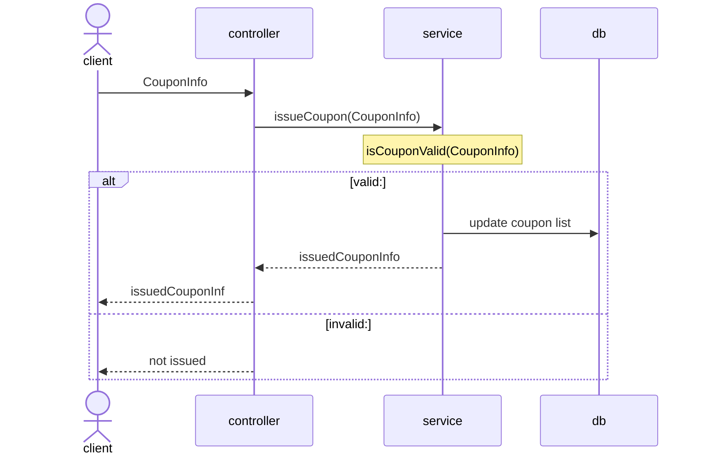

# 쿠폰 등록
---


> [CouponInfo]  
> couponNumber
> 인증이 필요한가 authenticationNeeded
> couponStocks
> couponDueDate
> couponType

## IsUserValidForCouponAuthenticationNeeded(userId, couponType)
* couponType == 개인 지정 쿠폰
  * userId를 위한 쿠폰이 있나?
* couponType == 단체 지정 쿠폰
  * userId가 화이트 리스트에 있나?


## IsCouponRegistrable(couponStocks, couponDueDate)
* 수량 제한이 있나?
  * 재고가 있나?
* 만기일이 있나?
  * 만기일 넘었나?

# 쿠폰 사용


## isCouponUsable(couponNumber)
* 존재하는 쿠폰인가?
* 유효 기간이 지났는가?
* 쿠폰 재고가 있는가?


### CouponInfo
* couponDueDate : DATE
* couponStockCnt : int
* CouponNumber : int
* couponType : {SINGULAR_NUM_AUTH_NEEDED, PLURAL_NUM_AUTH_UNNECESSARY, 
  SINGULAR_NUM_REDUNDANT_RECEIPTABLE, PLURAL_NUM_NONREDUNDANT_RECEIPTABLE}
* couponUserWhiteList : 


## IskUserValidForUsingCoupon(userId, couponType)

# 쿠폰 발급


## isCouponValid(CouponInfo)
* 필수 입력이 다 들어왔는기?
  * 쿠폰 정책 이름
  * 쿠폰 할인 구분
  * 다운로드 가능 기간
  * 사용할 수 있는 기간
  * 중복 가능 여부
  * 수량 제한 여부
  * 고객 인증 필요 여부
  * 쿠폰 이미지

```mermaid
participant s 
participant sv as couponValidationService

s->>sv: isCouponValid(CouponInfo)
sv->> s: True || False
```

## 고객사 리포팅 (보류)

